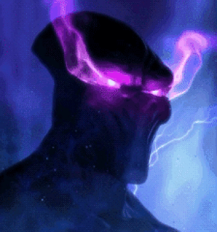

# ArchonBrain

**An experiment in giving an Archon a life of its own.**

What would it take for a familiar StarCraft character to respond to a world without a player issuing every command? ArchonBrain begins with one Archon, two energy sources, and a computational model based on the fruit-fly connectome.

The ambition is to give the character a sense of autonomy and vitality: a body whose actions are shaped by what it senses, and whose actions change what it senses next. “Life of its own” describes the creative goal, not a claim of consciousness or biological life.

This is an independent, **non-commercial fan-made creative project**, built out of an interest in StarCraft, neural simulation, and virtual characters. It is not affiliated with or endorsed by Blizzard Entertainment. StarCraft and its characters belong to their respective rights holders.

## Change the world; watch the response

Move an energy source and follow the chain: the sensory input changes, the neural model responds, and measured outputs influence the Archon’s movement and absorption. Movement changes the next inputs. Absorption changes how much energy remains.

The interesting part is the relationship between the visible body and the controller beneath it. Two simultaneous sources can produce a different path from one source. A source within reach may be absorbed, then released with energy still remaining. The demo lets you observe those responses instead of guaranteeing a perfect route or complete consumption.

| In the scene | In the control loop |
| --- | --- |
| A and B emit virtual signals | Position, distance and strength become sensory inputs |
| The neural display changes | The FlyWire v783 model produces measured activity |
| The Archon moves, turns or connects | Motor readouts and contact rules drive existing body control |
| A source loses energy | The changed environment becomes the next input |

The model runs locally in your browser through WebAssembly and a Web Worker. The body, gas, electrical connections and three satellites are rendered with Three.js. The moving scene is a live experiment, not a recorded animation.

## How much autonomy exists today?

The connected sensory → neural → body → environment loop is implemented. The default controller uses measured neural outputs for movement, turning, and absorption-related control, with target-following assistance off. Existing comparison tools can disconnect those outputs or remove directional information while retaining comparable starting conditions.

This is bounded autonomy within an engineered environment. The application supplies sensory mappings, motor decoding, contact policies, and detailed joint animation. The controller does not currently learn from experience, remember earlier runs, plan a strategy, or reproduce the original game’s unit AI.

## From one Archon to a wider cast

The long-term creative direction is to explore the same idea across **other StarCraft units**, potentially across the wider cast: how could different bodies and ways of sensing produce different forms of autonomous behavior?

An additional character would need its own body integration, sensory mapping, action interface and evaluation. A new mesh alone would not establish a new behavioral capability. Only the Archon is implemented today; support for the full roster is an aspiration, not an announced feature or delivery promise.

| Direction | What we want to investigate | Status |
| --- | --- | --- |
| Learning & adaptation | Whether limited parts of the control pathway can adapt through repeated trials | Planned exploration |
| Before-and-after evaluation | Whether an adapted controller improves over a fixed baseline on unseen layouts | Planned exploration |
| More interpretable behavior | How to show the contribution of neural outputs and application rules more clearly | Planned exploration |
| Other StarCraft units | How distinct bodies, inputs and tasks could expand this fan-made experiment | Long-term exploration |
| A more approachable demo | Make observation and interaction understandable without reading raw neural data | Ongoing refinement |

Progress should be demonstrated through behavior and comparison, not a training counter or a more elaborate animation. The current demo is the starting point for those experiments.

## Run locally

Use Node.js 22.12+ or 24 and pnpm 10.

```sh
pnpm install --frozen-lockfile
pnpm dev
```

Open http://127.0.0.1:5173. The initial download includes a roughly 30 MB neural graph and 31 MB body model. Neural computation runs in the browser using a Web Worker and WebAssembly.

```sh
pnpm build
pnpm preview --port 4173
```

The production output is `dist/`. Hosting must serve its JavaScript modules, WebAssembly and binary assets intact. No application account, backend API, or credentials are required.

## Explore

The default page starts the neural controller with two energy sources.

- Drag **A** or **B** in the scene to change the supplied signals.
- **View all** frames the body and sources and restores source editing.
- **Free view** enables rotation, wheel zoom, and middle-button drag to pan. Source editing is disabled while using this view.
- **Start over** restores the initial arrangement with a fresh neural state.
- Neural activity, the environment map, and remaining energy show the same running experiment.

With reduced motion enabled, use **Start** to begin. The live observation surface has a fixed 1280px layout; smaller windows use horizontal scrolling. The project overview below it adapts to narrower screens.

The separate `/?tools=1` route exposes existing experiment controls: source strength and deletion, Play/Pause, output and directional-input comparisons, Settings, and JSON save/load. Manual **Preview** is a visual motion inspection tool, separate from neural execution. Opening another tab starts a separate session.

Experiment files save starting conditions, including logical pose, source IDs, remaining energy, seed and control settings. Loading initializes a fresh paused brain; it does not restore an ongoing neural state, memory or animation.

## Scope

The sensory-to-neural-to-body feedback loop is implemented. Sensory mappings, motor decoding, contact rules and animation are application logic; not every joint movement emerges from the connectome. The current controller does not learn through repeated runs. Selecting the strongest source, visiting every source, or consuming all available energy is not guaranteed.

See [development and validation](docs/DEVELOPMENT.md) for architecture and test commands, and [assets and attribution](docs/ASSETS.md) for source versions and redistribution status.

## Checks

```sh
pnpm test:unit
pnpm lint
pnpm build
pnpm check:public
pnpm exec playwright test tests/experience-ui.spec.js tests/experiment-ui.spec.js
```

Browser tests execute the actual bundled neural model. See the development guide for browser setup. `check:public` scans the Git publication candidate for common accidental disclosures; it is a heuristic check, not a security or license certification.

## Third-party materials

The neural runtime and data originate from [satorunet/hae](https://github.com/satorunet/hae), with upstream attribution preserved in `public/neural/` and `third_party/hae/`. Original project code is available under the [MIT license](LICENSE). The body model was created by the maintainer using a paid Meshy plan and supplied for this project. It is distributed separately from the code license; see [asset terms](docs/ASSETS.md). Third-party code and data retain their respective licenses.
